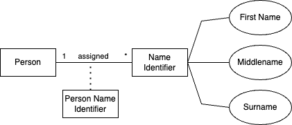

# SQL Schema

Here we present principles of translating a logical data model to SQL.

## Person Profile Domain

## Table Definition

NOTE: The focus of our implementation is the relationship between `person` and `name_identifier`

The domain is implemented with the following tables and fields:

* Table `person`
  * Primary key: `id`

* Table `person_named_identifier`
  * Primary key: `id`
  * Foreign key: `person_id` references `person (id)`
  * Foreign key: `named_identifier_id` references `named_identifier (id)`

* Table `named_identifier`
  * Primary key: `id`
  * TEXT (not null): `first_name`
  * TEXT (not null): `surname`
  * TEXT (not null): `nickname`
